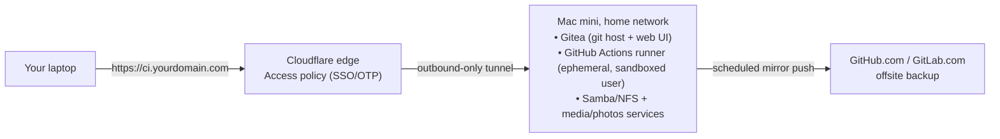

Every Mac app I ship needs a real macOS box to build, sign, and notarize on — and GitHub's hosted macOS runners bill at roughly 10x the rate of their Linux ones, precisely because Apple doesn't let anyone virtualize macOS cheaply. At the same time, I had a Mac mini doing nothing but sitting on a shelf. Putting the two facts next to each other is the whole idea of this post: the machine already paid for itself, it's silent, it barely sips power, and it can run CI jobs, hold a backup of my repos, and answer to a real hostname — without opening a single port on my router.

This is the setup, end to end: what's on the Mac, how the self-hosted runner is sandboxed, how Cloudflare Tunnel exposes it safely, how GitHub/GitLab stay in the loop as the offsite copy, what it actually costs versus paying per CI minute, and — since the box is on 24/7 anyway — what else it's now quietly doing as a small home NAS.

## The shape of it

Four pieces, each doing one job:

1. **The Mac mini** — always-on, low-power, sits on the home network. Runs [Gitea](https://about.gitea.com) as a local git host and runs the GitHub Actions runner.
2. **A self-hosted Actions runner** — registered to specific private repos only, running as an unprivileged, ephemeral service account, not my login user.
3. **Cloudflare Tunnel** (`cloudflared`) — the *only* way in from the outside. No inbound ports, no port forwarding on the router, no exposed IP. The tunnel dials out to Cloudflare's edge; Cloudflare terminates TLS and enforces access policy before anything reaches the Mac.
4. **GitHub/GitLab** — still the source of truth and the offsite backup. The Mac mini is a second, local copy — not a replacement for the cloud remote, a 3-2-1-style extra copy of it.



## Step 1 — Prep the Mac mini

Before anything touches the network, harden the box itself — it's now a server, not a laptop you carry around:

- **FileVault on.** `System Settings → Privacy & Security → FileVault`. If the machine is ever stolen, the disk is unreadable without the recovery key (store that key somewhere that isn't on the Mac itself).
- **A firmware/EFI password** or, on Apple silicon, requiring a password after a Mac restart in Recovery — stops someone with physical access from booting off external media.
- **Create a dedicated, non-admin local user** for everything server-related (call it `ci`). Never run the Actions runner or exposed services as your personal admin account.
- **Disable sleep, keep Wake-on-LAN off** (you don't need it — nothing should be waking this box from outside), and turn off automatic login.
- **`sudo softwareupdate --schedule on`** so security patches land without you remembering to click "Later" for a month.
- Give it a static local IP via a DHCP reservation on your router, so `cloudflared` and any local services always find it at the same address.

## Step 2 — Host a local copy of the repo, with Gitea

The simplest git server here would just be a bare repository over SSH — and that's genuinely enough if all you want is a remote. I went one step further and run [Gitea](https://about.gitea.com) instead: a single Go binary, no external database needed (SQLite is plenty at this scale), that turns the Mac mini into something closer to a personal GitHub — browsing diffs, PRs, and issues against your own repos instead of just `git log`-ing your way through a terminal.

Installing it, running it as an always-on `launchd` service under the same non-admin `ci` user, and wiring it into the Cloudflare Tunnel from Step 4 below is its own walkthrough: **[Gitea on the Mac Mini: A Self-Hosted Git Server with a Web UI](/blog/2026/07/29/gitea-mac-mini/)**. Come back here once it's running.

From your laptop, add it as a second remote alongside `origin` (GitHub):

```bash
git remote add homeserver git@git.yourdomain.com:you/myproject.git
git push homeserver main
```

Now you can push to either remote, and the Actions runner (next step) can clone from Gitea at LAN speed instead of pulling over the internet on every job.

## Step 3 — Register a self-hosted GitHub Actions runner, safely

Self-hosted runners are the part to be most careful with, because a job on that runner executes with whatever privileges the runner's user account has — on your home network. A few rules I stuck to:

- **Never register a self-hosted runner on a public repository.** A pull request from a stranger's fork can run arbitrary code on your runner via `pull_request_target` or a modified workflow file. Private repos only.
- **Run the runner as the unprivileged `ci` user**, not your admin account, and not root.
- **Use `--ephemeral`** so the runner tears down and re-registers after every single job — no state (cached credentials, leftover build artifacts, installed dependencies from a previous job) survives between runs.
- **Scope it to one repository**, not the whole org, via a repo-level runner registration rather than an org-wide one.

```bash
# on the Mac mini, logged in as the `ci` user
mkdir actions-runner && cd actions-runner
curl -o actions-runner-osx-arm64.tar.gz -L \
  https://github.com/actions/runner/releases/latest/download/actions-runner-osx-arm64-<version>.tar.gz
tar xzf actions-runner-osx-arm64.tar.gz

# token from: Settings -> Actions -> Runners -> New self-hosted runner, on the specific repo
./config.sh --url https://github.com/you/myproject \
  --token <REGISTRATION_TOKEN> \
  --ephemeral \
  --labels self-hosted,macos,mac-mini

# run it as a background service so it survives reboots
./svc.sh install
./svc.sh start
```

In the workflow itself, target the runner by label instead of `runs-on: macos-latest`, and keep secrets scoped to the environment that actually needs them:

```yaml
jobs:
  build:
    runs-on: [self-hosted, macos, mac-mini]
    steps:
      - uses: actions/checkout@v4
      - run: xcodebuild -scheme MyApp -configuration Release build
```

One more layer worth adding if you're security-conscious: run the runner inside a lightweight macOS VM (via `tart` or `UTM`) rather than directly on the host, so a compromised job is sandboxed away from the rest of the machine — the file shares from Step 6 included. That's the difference between "an ephemeral user account" and "an ephemeral machine," and for anything beyond a personal side project it's the safer default.

## Step 4 — Expose it with a Cloudflare Tunnel, not port forwarding

This is what lets you reach the Mac mini's services from outside your home network without ever opening an inbound port. `cloudflared` runs on the Mac and makes an *outbound* connection to Cloudflare's edge; nothing needs to be forwarded on your router, and there's no public IP to scan or attack.

```bash
brew install cloudflared
cloudflared tunnel login
cloudflared tunnel create home-server
```

Route a hostname to it in your Cloudflare DNS zone, and define which local services it fronts:

```yaml
# ~/.cloudflared/config.yml
tunnel: <tunnel-uuid>
credentials-file: /Users/ci/.cloudflared/<tunnel-uuid>.json

ingress:
  - hostname: git.yourdomain.com
    service: http://localhost:3000
  - hostname: photos.yourdomain.com
    service: http://localhost:2283
  - hostname: files.yourdomain.com
    service: http://localhost:5000
  - service: http_status:404
```

(`git.yourdomain.com` points at Gitea's web UI here — the [Gitea post](/blog/2026/07/29/gitea-mac-mini/) covers the extra `ingress` entry needed to also tunnel git-over-SSH.)

```bash
cloudflared tunnel route dns home-server git.yourdomain.com
cloudflared service install
```

Then put every hostname behind **Cloudflare Zero Trust Access**, not just Cloudflare's proxy — the proxy hides your IP, Access is what actually authenticates requests:

- Create an Access application per hostname, policy: "allow if email matches yourdomain@icloud.com" (with a one-time-code login) — or your GitHub identity via Cloudflare's GitHub SSO integration.
- For the git-over-SSH path, keep SSH key auth as the real authentication and use Access mainly to gate reachability.
- Turn on Cloudflare's WAF/rate limiting on the Access application as a second layer.

The net effect: `git.yourdomain.com` resolves and answers from anywhere, but nobody reaches port 22 on your Mac without first passing Cloudflare's identity check — and your home IP is never exposed to a port scanner in the first place.

## Step 5 — Mirror to GitHub/GitLab as the offsite backup

The Mac mini being the local, low-latency copy doesn't replace the cloud remote — it's the other way around: GitHub (or GitLab) stays the durable offsite copy in case the Mac mini's disk dies, gets stolen, or the house burns down. Standard 3-2-1 backup logic, just applied to git remotes.

Gitea can do this natively: open a repo, go to **Settings → Mirror Settings → Push Mirrors**, and add GitHub or GitLab as a target with a personal access token and a sync interval — no script to maintain, and the last-sync status is right there in the UI. If you're still on a plain bare repo, a `launchd` job does the same job by hand:

```bash
# ~/scripts/mirror-backup.sh, run as the ci user
cd ~/repos/myproject.git
git fetch homeserver --prune
git push --mirror https://github.com/you/myproject-mirror.git
git push --mirror https://gitlab.com/you/myproject-mirror.git
```

Either way, the point isn't real-time replication, it's making sure a second, independent copy exists somewhere you don't control the power switch for.

## Security checklist

- [ ] FileVault enabled, firmware/Recovery password set
- [ ] Server-related services run under a dedicated non-admin user, never your personal login
- [ ] Self-hosted runner: private repos only, `--ephemeral`, scoped to one repo, ideally inside a VM
- [ ] No ports forwarded on the router — Cloudflare Tunnel is the only inbound path
- [ ] Every tunneled hostname sits behind a Cloudflare Access policy, not just the proxy
- [ ] Automatic security updates on; the Mac mini isn't something you remember to patch manually
- [ ] Secrets live in GitHub Actions secrets / Cloudflare, never hardcoded in the workflow or on disk in plaintext
- [ ] A real offsite mirror exists (GitHub/GitLab) that doesn't depend on the Mac mini being alive
- [ ] If running Gitea: admin 2FA on, self-registration disabled, kept up to date (see the [dedicated Gitea post](/blog/2026/07/29/gitea-mac-mini/) for the full checklist)

## What it actually costs vs. hosted CI minutes

Numbers below use a base Mac mini M4 at **$599** and typical Apple-silicon idle/light-build power draw — treat them as ballpark, not a quote; check current Apple pricing and your own electricity rate before doing the math for real.

**Running cost.** A Mac mini idles around 5–7W and pulls maybe 15–30W during a CI build. Averaged over a day that's realistically **~15W continuous**:

```
15W × 24h × 365 days = 131.4 kWh/year
131.4 kWh × $0.16/kWh (US avg) ≈ $21/year
```

**Hosted GitHub Actions minutes**, at roughly current per-minute billing on private repos (Linux ~$0.008/min, macOS ~$0.08/min — macOS runners cost 10x because Apple restricts macOS virtualization to Apple hardware, so GitHub is paying for real Mac hardware per minute too):

| Monthly macOS CI minutes | Hosted cost/month | Hosted cost/year |
|---|---|---|
| 200 min (light) | $16 | $192 |
| 500 min (a build+test+notarize pipeline) | $40 | $480 |
| 1,500 min (several apps, frequent CI) | $120 | $1,440 |

Against a **$599 one-time cost + ~$21/year to run**, the 500-minute scenario pays the Mac mini back in **under 15 months**, and every CI minute after that is free compute on hardware that's also doing the NAS/media-server work below. The 1,500-minute scenario pays it back in under 5 months. Below ~150 minutes/month, hosted runners are cheap enough that self-hosting is about control and privacy more than money — which is a fine reason too.

## Self-hosted Mac mini vs. a regular cloud setup

| | Self-hosted Mac mini | Regular cloud (GitHub-hosted / VPS) |
|---|---|---|
| **Upfront cost** | $599+ hardware | $0 |
| **Marginal cost per CI minute** | ~free after purchase | Billed per minute, macOS ~10x Linux |
| **macOS/Xcode builds** | Native, full speed, no virtualization tax | Expensive, sometimes queued during peak hours |
| **Setup effort** | You own the OS, patches, hardware failures | Zero — it's already running |
| **Availability** | Depends on your home power/internet; one box, no redundancy | Provider SLA, multi-region by default |
| **Data locality/privacy** | Repo and secrets never leave hardware you physically control | Trusting the provider's isolation between tenants |
| **Scaling** | Bounded by one machine's CPU/RAM | Elastic — spin up as many runners as you'll pay for |
| **Attack surface if misconfigured** | Your home network, if a tunnel/port is exposed carelessly | Provider's perimeter, generally hardened by default |
| **Backup story** | You must build it (Step 5) | Provider handles most of it, but you're still trusting one vendor |

The honest takeaway: this is worth it once you have real, recurring CI load — especially macOS/Xcode builds — and you're comfortable owning the security of one box on your home network. For occasional CI on a small project, hosted minutes are simpler and the free tier probably covers you already. For me, running Grove's build/notarize pipeline plus a handful of other repos, the math and the "I already own the hardware" reality both point the same way.

## Bonus: the same box as a small home NAS

Since it's on 24/7 for CI anyway, the marginal cost of also running a home NAS on it is close to zero — and it's a genuinely useful upgrade over paying for cloud storage/photo backup subscriptions.

**File sharing (SMB/NFS).** macOS ships this natively — `System Settings → General → Sharing → File Sharing`, add the folders you want shared, and enable SMB. For Time Machine backups from other Macs on the network, check "Time Machine backup destination" under the same panel; it's the least-effort way to get every other Mac in the house backed up locally.

**Photo backup — [Immich](https://immich.app).** Self-hosted, open-source, with iOS/Android apps that auto-upload from your phone the same way iCloud Photos or Google Photos would — except the originals stay on hardware you own:

```yaml
# docker-compose.yml (Immich needs Docker Desktop or OrbStack on the Mac)
services:
  immich-server:
    image: ghcr.io/immich-app/immich-server:release
    ports: ["2283:2283"]
    volumes: ["/Volumes/External/immich:/usr/src/app/upload"]
    env_file: .env
```

**Media server — [Jellyfin](https://jellyfin.org).** Open-source Plex alternative, no subscription, streams your own media library to any device — including outside the house, through the same Cloudflare Tunnel used for everything else.

**Remote access to all of it.** Add each service as another `ingress` entry in the `cloudflared` config from Step 4, put it behind its own Access policy, and you've got iCloud-Photos-and-Plex-equivalent functionality, self-hosted, for the cost of the electricity — reachable from anywhere, exposed to nowhere.

The pattern repeats: one Mac mini, one Cloudflare Tunnel, an Access policy per service, and every new thing you host on it costs approximately nothing extra to run or to expose safely.

---

If you're weighing this for your own setup — different hardware, a NAS box instead of repurposing a Mac, whatever — I'd genuinely like to compare notes: `hello@molayab.com`, or find me on X below.

Next up: [installing Gitea on this same Mac mini](/blog/2026/07/29/gitea-mac-mini/) as the always-on git host referenced in Step 2 above.
