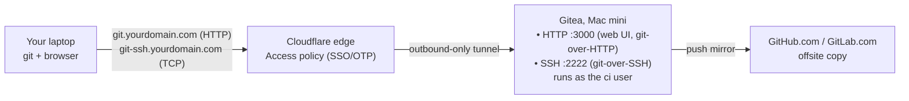

If you haven't already, [set up the Mac mini itself](/blog/2026/07/27/mac-mini-home-server/) first — FileVault, a dedicated `ci` user, a static local IP, and a Cloudflare Tunnel are the foundation this post builds on. That post's Step 2 points here for the git host: [Gitea](https://about.gitea.com) instead of a plain `git init --bare` repo over SSH. A bare repo is honest and works, but it has zero web UI — no browsing a diff, no PR review, no issue tracker, nothing to look at except `git log` in a terminal. This post is the full walkthrough: same Mac mini, same `ci` user, same Cloudflare Tunnel, just a real git host running on top of it instead of a folder with a `.git` extension.

## Why Gitea over a bare repo

A few reasons this was worth the extra service instead of sticking with plain SSH:

- **A web UI, for free.** Browsing code, diffing commits, opening issues and pull requests against your own repos — all the things you'd otherwise SSH in and `git log --oneline` your way through.
- **One small binary.** Gitea ships as a single Go binary with no runtime dependencies. No JVM, no Node, nothing to keep patched beyond the binary itself.
- **SQLite is enough at this scale.** For one person's repos, Gitea's built-in SQLite backend is plenty — no separate Postgres/MySQL container to run, back up, or worry about crashing independently of the app.
- **It's still just git underneath.** Nothing else in the existing setup changes in spirit: the self-hosted Actions runner still clones locally at LAN speed, the offsite mirror in Step 5 of the parent post still exists (Gitea just does it more cleanly now — more on that below).

The tradeoff is honest, too: it's one more service to keep updated and one more thing exposed through the tunnel. For a single-repo, single-user setup, plain SSH is genuinely simpler. I wanted the web UI enough to accept that.

## Installing it

Homebrew is the path of least resistance:

```bash
# as your normal admin user — not ci
brew install gitea
```

I install it under my own admin account rather than `ci`, on purpose: Homebrew expects to own its prefix (`/opt/homebrew`) and isn't happy running under a locked-down, non-admin account. That's fine — the binary being *installed* by an admin user and the service *running* as `ci` are two different things, and the next section is how to split them.

If you'd rather run it in a container — OrbStack or Docker Desktop both work fine on the Mac mini — the official `gitea/gitea` image is the equivalent path:

```yaml
# docker-compose.yml, alternative to the launchd approach below
services:
  gitea:
    image: gitea/gitea:latest
    environment:
      - USER_UID=501
      - USER_GID=20
    ports:
      - "3000:3000"
      - "2222:22"
    volumes:
      - /Users/ci/gitea-data:/data
```

I stuck with the Homebrew binary + `launchd` route, mostly to keep this box's service list consistent with everything else in the parent post (the Actions runner, `cloudflared`, the mirror job) — no Docker daemon to also keep patched. Pick whichever matches how you're already running the rest of the box.

## Running it as a service, not a terminal window

This is the part that matters: Gitea needs to survive reboots, start before anyone logs in, and run as the unprivileged `ci` user — the same "one dedicated non-admin user for everything server-related" rule from the parent post's Step 1, not a new account just for this.

Give `ci` a home for Gitea's data, separate from the binary:

```bash
sudo mkdir -p /Users/ci/gitea
sudo chown -R ci:staff /Users/ci/gitea
```

Then define a `LaunchDaemon` (system-level, so it starts at boot regardless of who's logged in) that runs the `gitea` binary as `ci`:

```xml
<!-- /Library/LaunchDaemons/com.gitea.server.plist -->
<?xml version="1.0" encoding="UTF-8"?>
<!DOCTYPE plist PUBLIC "-//Apple//DTD PLIST 1.0//EN" "http://www.apple.com/DTDs/PropertyList-1.0.dtd">
<plist version="1.0">
<dict>
    <key>Label</key>
    <string>com.gitea.server</string>
    <key>UserName</key>
    <string>ci</string>
    <key>ProgramArguments</key>
    <array>
        <string>/opt/homebrew/bin/gitea</string>
        <string>web</string>
    </array>
    <key>WorkingDirectory</key>
    <string>/Users/ci/gitea</string>
    <key>EnvironmentVariables</key>
    <dict>
        <key>GITEA_WORK_DIR</key>
        <string>/Users/ci/gitea</string>
        <key>HOME</key>
        <string>/Users/ci</string>
    </dict>
    <key>RunAtLoad</key>
    <true/>
    <key>KeepAlive</key>
    <true/>
    <key>StandardOutPath</key>
    <string>/Users/ci/gitea/gitea.stdout.log</string>
    <key>StandardErrorPath</key>
    <string>/Users/ci/gitea/gitea.stderr.log</string>
</dict>
</plist>
```

(`/opt/homebrew/bin/gitea` is the Apple silicon path — `/usr/local/bin/gitea` on Intel.) `UserName` is the key that matters: it's what makes a *system* daemon, installed by an admin, actually run as `ci` at the process level, rather than tying the service to whichever account happened to run `brew services start`.

```bash
sudo launchctl bootstrap system /Library/LaunchDaemons/com.gitea.server.plist
```

Gitea lays out its own directory structure under `GITEA_WORK_DIR` on first launch — `custom/conf/app.ini`, `data/`, `log/` — all owned by `ci`, all under `/Users/ci/gitea`.

## First-run configuration

Before this touches the Cloudflare Tunnel, visit `http://mac-mini.local:3000` (or `http://<its static IP>:3000`) from another machine on the same LAN and walk through Gitea's install wizard once: pick SQLite3 as the database (nothing to configure — it just works), set the site title, and create the first admin account. Do this before the tunnel ingress exists in the next section, so the unauthenticated installer page is never reachable from outside your home network.

Once that's done, lock it down by editing `app.ini` directly:

```ini
# /Users/ci/gitea/custom/conf/app.ini
[server]
DOMAIN           = git.yourdomain.com
HTTP_ADDR        = 0.0.0.0
HTTP_PORT        = 3000
ROOT_URL         = https://git.yourdomain.com/
START_SSH_SERVER = true
SSH_DOMAIN       = git.yourdomain.com
SSH_PORT         = 2222
SSH_LISTEN_PORT  = 2222

[service]
DISABLE_REGISTRATION = true

[security]
INSTALL_LOCK = true
```

- **`ROOT_URL`** is the hostname you'll actually reach it at once the tunnel is wired up — set it now so every link Gitea generates (clone URLs, avatar links, webhook payloads) points at `git.yourdomain.com`, not `mac-mini.local`.
- **`DISABLE_REGISTRATION = true`** turns off public sign-up entirely. New accounts only get created by an admin, from the Admin Panel — effectively invite-only, since there's no public form to find.
- **`INSTALL_LOCK = true`** re-locks the installer wizard so it can never be re-run, even by accident.

Restart the service to pick the changes up:

```bash
sudo launchctl kickstart -k system/com.gitea.server
```

Then log into the admin account and turn on 2FA under **Settings → Security → Two-Factor Authentication** — a TOTP app is all it needs. This is the one account on the box that can create other accounts and touch every repo, so it's the one account where 2FA isn't optional.

## SSH on a port that isn't 22

macOS's own `sshd` already owns port 22 on this box — that's how you and the Actions runner's `ci` user log in per the parent post. Gitea ships its own, completely separate Go-native SSH server for git-over-SSH, and `START_SSH_SERVER = true` above turns it on listening on 2222 instead, so the two never fight over the same port.

From another machine on the LAN:

```bash
git clone ssh://git@mac-mini.local:2222/you/myproject.git
```

One thing worth knowing ahead of time: the first connection will prompt you to accept a *new* host key fingerprint, separate from the Mac's regular OpenSSH one. That's expected — it's a different SSH server, with its own host keys under `/Users/ci/gitea/data/ssh`, not a misconfiguration.

## Wiring it into the Cloudflare Tunnel

Same `cloudflared` setup from the parent post's Step 4, just two more `ingress` entries in `~/.cloudflared/config.yml` — one for the web UI/git-over-HTTP, one for raw TCP so git-over-SSH can ride the tunnel too:

```yaml
# ~/.cloudflared/config.yml
tunnel: <tunnel-uuid>
credentials-file: /Users/ci/.cloudflared/<tunnel-uuid>.json

ingress:
  - hostname: git.yourdomain.com
    service: http://localhost:3000
  - hostname: git-ssh.yourdomain.com
    service: tcp://localhost:2222
  - hostname: photos.yourdomain.com
    service: http://localhost:2283
  - hostname: files.yourdomain.com
    service: http://localhost:5000
  - service: http_status:404
```

```bash
cloudflared tunnel route dns home-server git.yourdomain.com
cloudflared tunnel route dns home-server git-ssh.yourdomain.com
```

Put both new hostnames behind a **Cloudflare Zero Trust Access** policy, same pattern as every other hostname in the parent post — an Access application per hostname, "allow if email matches yourdomain@icloud.com," nothing new to explain there.

The HTTP side just works once DNS and Access are in place — `https://git.yourdomain.com` is the web UI, and `git clone https://git.yourdomain.com/you/myproject.git` works the same way it would against GitHub. The TCP/SSH side needs one extra piece on the client, since raw TCP over a Cloudflare Tunnel isn't something an SSH client can dial directly — `cloudflared` has to open a local proxy for it:

```bash
# on your laptop, once per session (or wrap it in a shell function)
cloudflared access tcp --hostname git-ssh.yourdomain.com --url localhost:2222
```

That opens a listener on `localhost:2222` that forwards through the tunnel — behind the same Access login as everything else — to Gitea's SSH server on the Mac mini. With that running, clone against `localhost` as if the Mac mini were sitting right there:

```bash
git clone ssh://git@localhost:2222/you/myproject.git
```

It's an extra step compared to a plain port-forward, but the tradeoff is the same one the parent post makes everywhere else: port 2222 is never actually open to the internet, only reachable after Cloudflare's edge authenticates you first.

## Backing it up automatically

Gitea bundles its own backup tool — `gitea dump` archives the database, repos, and config into a single zip, so there's no separate "back up SQLite" and "back up the repos" and "back up app.ini" to remember:

```bash
#!/bin/bash
# ~/scripts/gitea-backup.sh, run as the ci user
cd /Users/ci/gitea
/opt/homebrew/bin/gitea dump \
  -c /Users/ci/gitea/custom/conf/app.ini \
  -w /Users/ci/gitea \
  -f /Users/ci/backups/gitea-dump-$(date +%Y%m%d).zip
```

Same pattern as the parent post's nightly mirror job: a `launchd` plist firing that script once a night (a `StartCalendarInterval` block at, say, 2 a.m.) is enough — the point isn't continuous backup, it's making sure a restorable snapshot exists without you remembering to run the command yourself.

## Offsite mirroring, the native way

The parent post's Step 5 hand-rolls the offsite copy with a `git push --mirror` script on a nightly timer. Gitea can do the same job natively now, and it's worth switching to: open a repo, go to **Settings → Mirror Settings → Push Mirrors**, and add GitHub or GitLab as a target with a personal access token and a sync interval. Gitea keeps it in sync on its own schedule and shows you the last-sync status right in the UI — no separate script to maintain, no silent failure you only notice when you actually need the backup. Same 3-2-1 logic as before (GitHub/GitLab stays the durable offsite copy in case the Mac mini's disk dies), just one less moving part you built by hand.



## Security checklist

- [ ] Admin account has 2FA on and a strong, unique password
- [ ] `DISABLE_REGISTRATION = true` — no public sign-up, admin-created accounts only
- [ ] Gitea kept updated (it's one binary — `brew upgrade gitea` and a service restart)
- [ ] Git-over-SSH runs on 2222, not 22, and is only reachable through the tunnel + Access policy
- [ ] Both `git.yourdomain.com` and `git-ssh.yourdomain.com` sit behind their own Cloudflare Access policy
- [ ] `gitea dump` scheduled nightly via `launchd`, not something you remember to run manually
- [ ] A push mirror to GitHub/GitLab exists and its last-sync status is actually green

---

This slots into the same home-server setup as [the Mac mini post](/blog/2026/07/27/mac-mini-home-server/) — same box, same `ci` user, same tunnel, just a git host with a UI instead of a bare repo. If you're running Gitea or Forgejo somewhere similar and have opinions on the setup, I'd like to compare notes: `hello@molayab.com`, or find me on X below.
