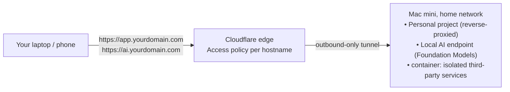

The [Mac mini home-server post](/blog/2026/07/27/mac-mini-home-server/) covers the part that doesn't change here: FileVault on, a dedicated non-admin `ci` user for anything server-related, a static local IP, and a Cloudflare Tunnel as the only way in from outside — no ports forwarded, ever. The [Gitea post](/blog/2026/07/29/gitea-mac-mini/) put a real git host on top of that. Same box, same `ci` user, same tunnel. This post is about the rest of what an always-on Mac quietly turns into once you stop thinking of it as "the CI machine" and start thinking of it as "the machine that's just... on."

Three things, plus one piece of macOS trivia that turns out to matter a lot more than it sounds like it should:



## Step 1 — Serve a real HTTPS project, not just infra

Everything tunneled so far — Gitea, Immich, Jellyfin — is infrastructure you installed, not something you built. But the same `cloudflared` ingress pattern from the parent post's Step 4 doesn't care what's on the other end of the port. If you're building a small web app or API of your own, it's just another entry:

```yaml
# ~/.cloudflared/config.yml
ingress:
  - hostname: git.yourdomain.com
    service: http://localhost:3000
  - hostname: photos.yourdomain.com
    service: http://localhost:2283
  - hostname: files.yourdomain.com
    service: http://localhost:5000
  - hostname: app.yourdomain.com
    service: http://localhost:8080          # your own project
  - service: http_status:404
```

Run the app itself the same way you'd run any other always-on service on this box — a `launchd` job under the `ci` user (or its own dedicated user if you want it walled off from Gitea's files too, more on that below), listening on `localhost` only, never on `0.0.0.0`. The tunnel is what makes it reachable, not the app binding to your LAN.

```bash
cloudflared tunnel route dns home-server app.yourdomain.com
```

Then the same rule as every other hostname in this setup: a Cloudflare Access application for `app.yourdomain.com`, policy "allow if email matches yours," before it's reachable at all. It's tempting to skip this step for a throwaway side project — "it's just a toy, who cares" — but a toy project with an unauthenticated database-backed API on a public hostname is exactly the kind of thing that gets found by a scanner within a day. Access takes two minutes to set up per hostname; there's no good reason to skip it just because the thing behind it feels low-stakes.

## Step 2 — Turn it into a local AI server

This is the part I didn't expect to be running on a home server a year ago. macOS 26 shipped Apple's **Foundation Models framework** — a real, first-party Swift API (`import FoundationModels`) that gives any app direct access to the same on-device model Apple Intelligence uses, running on the Neural Engine, no network round-trip, no API key:

```swift
import FoundationModels

let session = LanguageModelSession()
let response = try await session.respond(to: "Summarize this in one sentence: \(text)")
print(response.content)
```

I've actually used this directly in an app before — [`swift-ai-provider-kit`](/blog/2026/07/25/swift-ai-provider-kit/) wraps it as one of three interchangeable providers alongside Claude and OpenAI. That's the "call it from Swift, inside an app" path. What's new here is calling it from *outside* Swift entirely — from a shell script, a curl command, another machine on your network, or any tool that already knows how to talk to an OpenAI-shaped API.

That's what community wrappers like `maclocal-api` do: they sit in front of `LanguageModelSession`, listen on localhost, and expose it as an OpenAI-compatible `/v1/chat/completions` endpoint. Anything that speaks that API — a script, a CLI tool, a project on another machine — can point at it as if it were talking to OpenAI, except the model is running locally on the Neural Engine and nothing ever leaves the house.

The pleasant surprise is how cheap this is to run. The wrapper process itself isn't holding a model in memory — it's a thin shim making requests to `IntelligencePlatformComputeService`, the system service that's already running and already managing Apple's on-device model regardless of whether you use it. People running these wrappers report idle memory in the tens of megabytes, not the gigabytes you'd expect from "an AI server." It's the difference between running a model and just being a client to one that macOS already keeps warm.

Wire it up the same way as everything else on this box — a background service under `ci`, bound to localhost, fronted by the tunnel:

```xml
<!-- /Library/LaunchDaemons/com.local-ai.server.plist -->
<?xml version="1.0" encoding="UTF-8"?>
<!DOCTYPE plist PUBLIC "-//Apple//DTD PLIST 1.0//EN" "http://www.apple.com/DTDs/PropertyList-1.0.dtd">
<plist version="1.0">
<dict>
    <key>Label</key>
    <string>com.local-ai.server</string>
    <key>UserName</key>
    <string>ci</string>
    <key>ProgramArguments</key>
    <array>
        <string>/Users/ci/local-ai/start.sh</string>
    </array>
    <key>RunAtLoad</key>
    <true/>
    <key>KeepAlive</key>
    <true/>
    <key>StandardOutPath</key>
    <string>/Users/ci/local-ai/stdout.log</string>
    <key>StandardErrorPath</key>
    <string>/Users/ci/local-ai/stderr.log</string>
</dict>
</plist>
```

```yaml
# ~/.cloudflared/config.yml, one more entry
  - hostname: ai.yourdomain.com
    service: http://localhost:8090
```

Behind an Access policy like everything else — this one especially. An unauthenticated inference endpoint is free compute for anyone who finds it, and it's your electricity bill either way.

One caveat worth saying plainly: this only works on Apple silicon, and only once Apple Intelligence itself is turned on for the box (`System Settings → Apple Intelligence & Siri`), which — as of writing, on macOS 27 "Golden Gate" — still means an account has to enable it at least once. Do that step once, logged in, and the background service can lean on it indefinitely after that, same as any other daemon on this machine.

## Step 3 — Isolate services with a container, or just another user

The parent post's answer to "how do I keep one service from touching another" was a dedicated, non-admin user — `ci` owns the runner, Gitea, the tunnel, all of it, so a bug in one of them can't read your personal files or use your admin privileges. That's real isolation, and it's still the right default for anything you wrote or trust.

But it's file-permission isolation, not kernel isolation — everything running as `ci` still shares the same kernel, the same process table, the same view of the network stack. For code you *don't* fully trust — someone else's Dockerfile, a project you're just trying out, anything you want to be able to nuke and forget about — Apple shipped a real answer to that gap this year: the **`container` CLI**, 1.0 as of June 2026, Apple-silicon only. It runs each container as its own lightweight VM via the Virtualization framework, instead of every container sharing the host kernel the way Docker's containers do.

```bash
container system start
container run --rm -p 8081:80 ghcr.io/someproject/app:latest
container ls
```

That's a real, separate virtual machine per container, not a namespace-and-cgroups sandbox — a compromised process inside it doesn't get your kernel, because it isn't running on your kernel. And there's no persistent daemon sitting around with root, the way `dockerd` traditionally has — one less always-on process with elevated privileges to keep patched.

So which do you reach for? My rule of thumb, having now run both patterns side by side for a while: if it's your own code and you mostly want it to not have your keys lying around, a dedicated user is simpler and cheaper — no VM overhead, and Gitea in particular benefits from direct filesystem access for its own backups. If it's third-party code, something you're evaluating rather than vouching for, or you specifically want the failure mode to be "this VM goes away" rather than "this process gets killed," `container` is worth the extra weight. I've landed on: `ci` for the stuff I wrote and trust, `container` for everything else.

## Step 4 — The GUI-vs-headless wrinkle

This one is genuinely useful to understand on its own, separate from anything else in this post, because it explains a category of "why won't this just run in the background" bug that has nothing to do with permissions or ports.

macOS's service manager, `launchd`, runs things in different "domains" depending on what they are. A **daemon** runs in the global system domain — it starts at boot, doesn't care who's logged in, and keeps running through logout and all the way to the login window. Everything in this post and the parent posts so far — `cloudflared`, Gitea, the Actions runner, the local AI wrapper — is this kind: plain background processes with no need for a desktop.

An **agent**, by contrast, is tied to a specific user, and can be scoped further to a specific *session type* via the `LimitLoadToSessionType` key in its plist — Aqua (a real, logged-in desktop with a windowed UI), Background, or LoginWindow. `gui/{uid}` — the session domain an Aqua agent lives in — only exists while that user is actually logged into a graphical desktop. Log out, and that domain disappears; anything scoped to it stops running until someone logs back in.

Here's the part that trips people up: a daemon **ignores `LimitLoadToSessionType` entirely**. You can put it in a `LaunchDaemon` plist and it'll do nothing, because daemons always run in the global session regardless of what you write there — that key only means something for agents. So the question is never "can I make my background service respect session type," it's "does this thing actually need a windowed session, or can it just be a daemon."

Almost everything in this post doesn't need one. The one thing that genuinely does: **iOS Simulator**, and UI-automation tooling generally. Simulator draws real windows and talks to `WindowServer`, and `WindowServer` only exists inside an actual Aqua session — there's no headless mode for it. If you want this Mac mini to also run unattended UI tests against Simulator, you need a real account staying logged into Aqua, not just a daemon that's technically running. Which means reconsidering auto-login specifically for that use case — the parent post's hardening step says to turn it off, and that's still right for the box as a whole, but if part of its job is Simulator automation, that's a deliberate, scoped exception you're choosing to make, not something to do by accident.

## Security checklist

- [ ] Every new hostname (project, AI endpoint) gets its own Cloudflare Access policy — no "it's already inside the tunnel, that's enough" shortcuts
- [ ] Your own project binds to `localhost` only, never `0.0.0.0` — the tunnel is the only path in
- [ ] The local AI endpoint sits behind Access too; an open inference endpoint is free compute for whoever finds it
- [ ] Third-party or untrusted code runs inside `container`, not directly under `ci` or any account with real filesystem access
- [ ] `container` images pulled from sources you trust, kept updated like any other dependency
- [ ] If any service needs a logged-in Aqua session (Simulator/UI automation), that account is scoped to just that job — not your admin account, and auto-login enabled only for that specific, deliberate reason
- [ ] Container/VM images and the local AI wrapper don't hold long-lived credentials — treat them as disposable, not as another place to store secrets

---

If you're building this out yourself and hit the GUI-vs-headless wall on something I didn't cover here, or have opinions on `container` versus VMs like `tart`/`UTM` for isolation, I'd like to compare notes: `hello@molayab.com`, or find me on X below. This slots in right after [the Gitea post](/blog/2026/07/29/gitea-mac-mini/) and builds on [the base Mac mini setup](/blog/2026/07/27/mac-mini-home-server/) — same box, same `ci` user, same tunnel, just more of it doing real work now.
